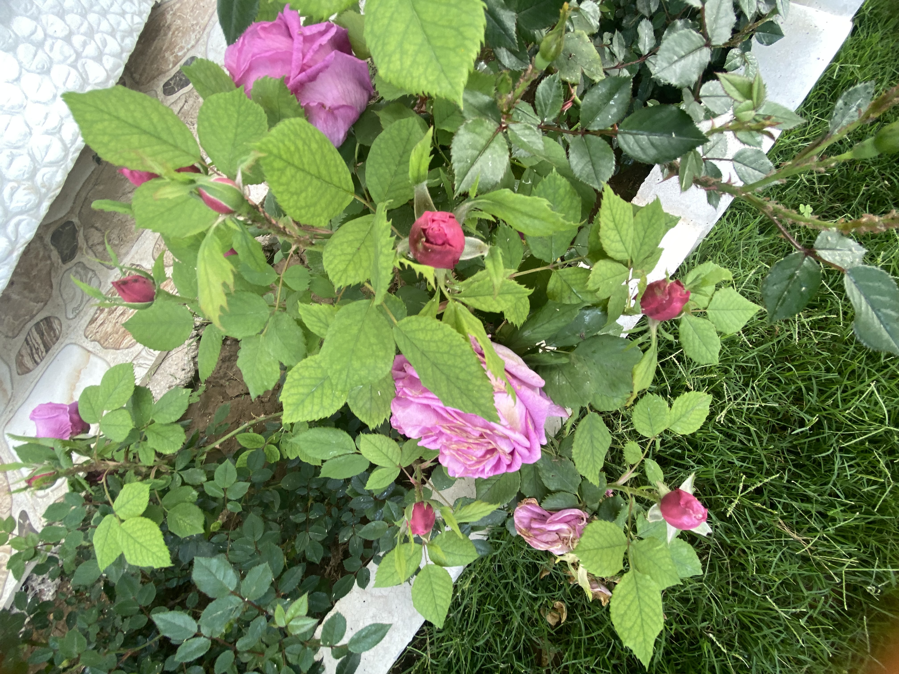
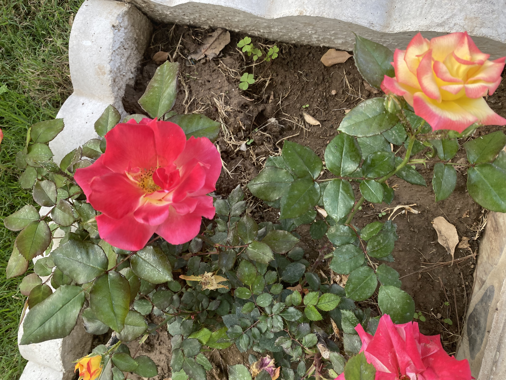
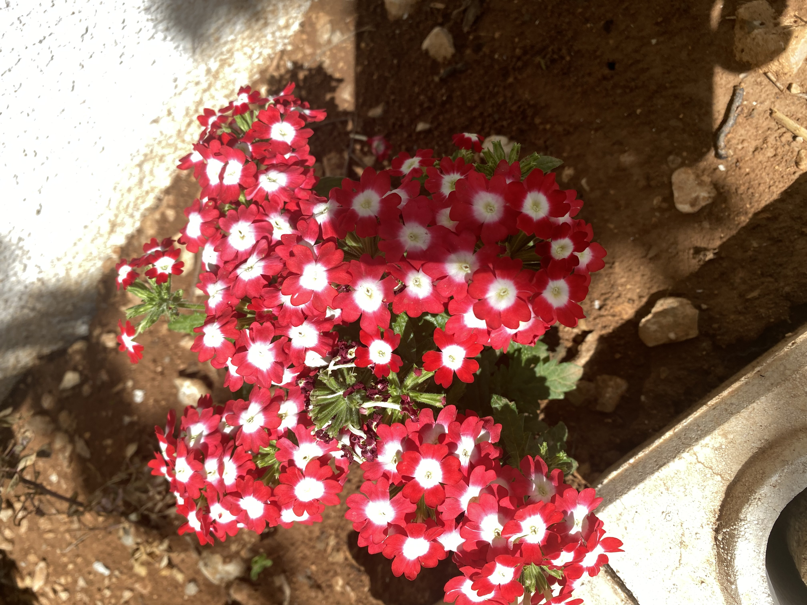
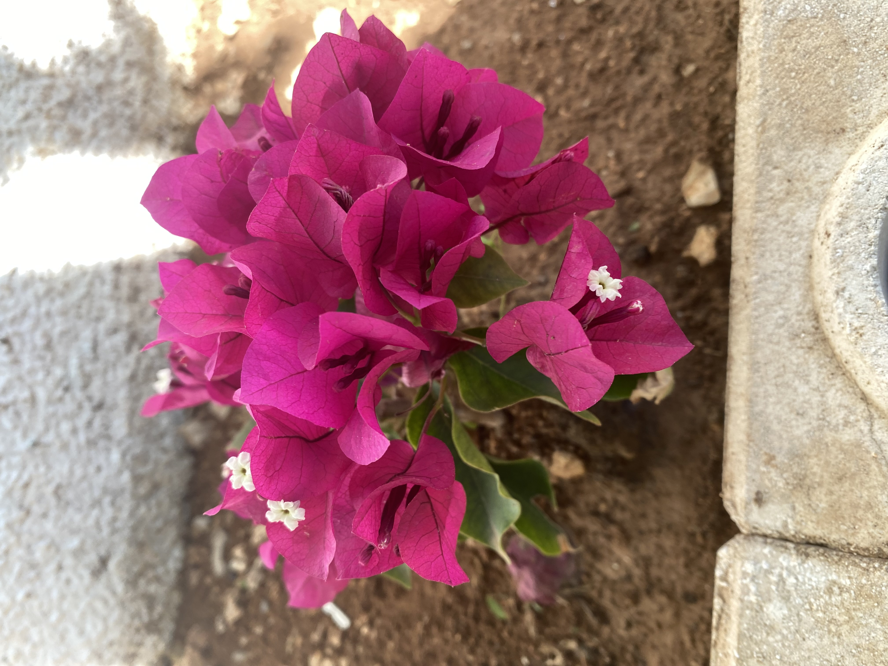

# Marp


<https://marp.app/>

---

## What to do



- download VSC <https://code.visualstudio.com/download>

- install Marp extension
<https://marketplace.visualstudio.com/items?itemName=marp-team.marp-vscode>

---

### Flowers 1

- nature

- beautiful

- give them water everyday

- care about



---

### Flowers 2



- garden
- one day I like to have millions of flowers
- beauty place

---

### Table in Marp



- my favourite flowers
- lovely

```python
print("Hello World!");
```

| header | header |
| --- | --- |
| content | content |
| content | content |

---

#### Export & download


- export as html, pdf  or powerpoint document

If you like more videos give me "like" and subscribe my Channel.

<https://github.com/strass141>
